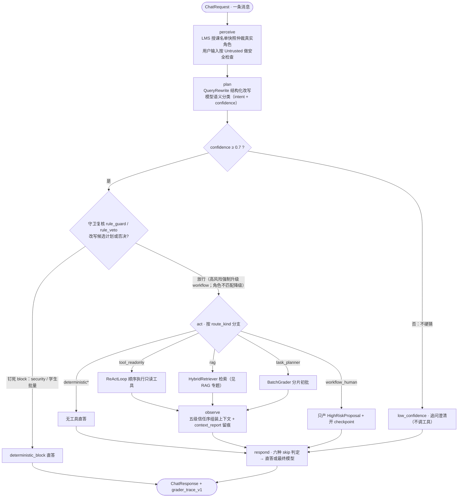
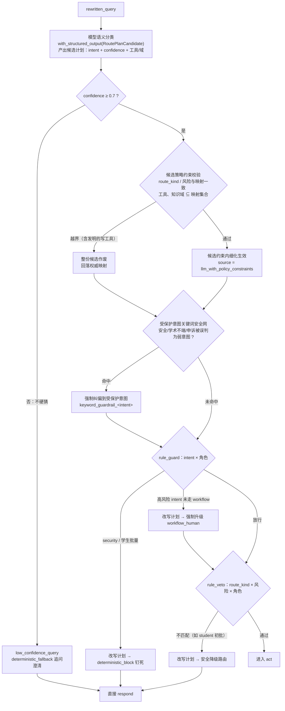
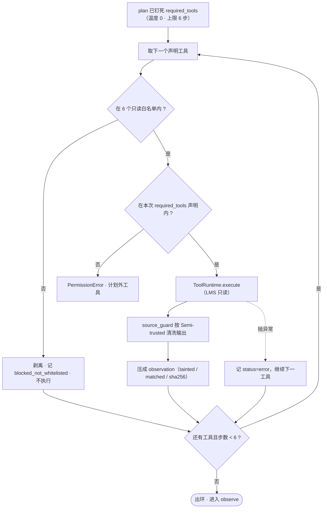
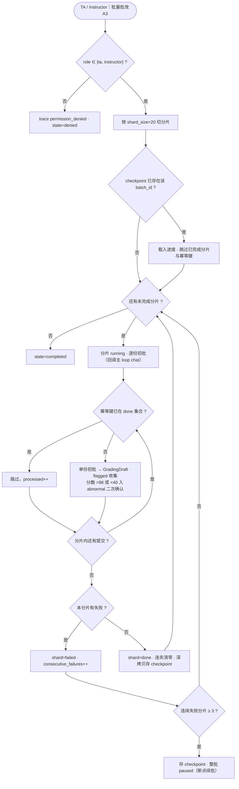
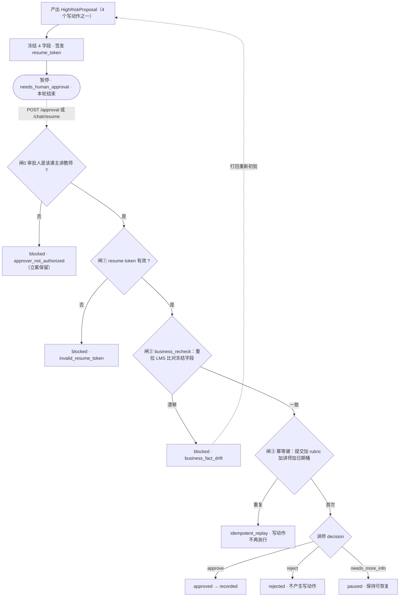

# Agent 设计：五阶段模型回路

> 这是 Grader 的 **Agent 专题文档**。`agent/` 是"模型被调用的地方"：一条消息进来怎么被理解、查证、批改、作答。本文按 **perceive → plan → act → observe → respond** 的业务叙事组织：§2 先看一条消息的完整旅程，§3–§7 逐阶段展开，§8–§9 讲跨请求的两件事——会话管理与 checkpoint/resume。
>
> 返回 [项目首页 README](../README.md) ｜ 相关专题：[RAG 检索](./rag.md) ｜ [Harness 安全骨架](./harness.md) ｜ [生产化升级方案](./engineering.md) ｜ [HTTP API](./api.md) ｜ [快速开始](./getting_started.md)

---

## 1. agent 域的边界

`agent/` 只放"模型回路"——一切会调用 LLM、或围绕一次模型调用做编排的逻辑。它**不知道怎么否决自己**：越权拦截、权限仲裁、防注入、审批闸、trace 脱敏都在 [`harness/`](./harness.md)。

| 文件 | 职责 |
|---|---|
| `loop.py` | `GraderAgent`：五阶段主循环 `chat()`、跨请求审批恢复 `resume()`、进程级单例 |
| `query_rewrite.py` | `QueryRewrite` 结构化改写：指代消解 / 口语归一 / 子问题分解 |
| `intent_router.py` | 12 intent 语义路由 + 受保护意图关键词安全网（守卫本体在 harness） |
| `react_loop.py` | 只读工具回路：按路由声明的工具顺序执行，白名单对账 |
| `final_answer.py` | `FinalAnswerComposer`：最终答案组装、六种 skip、`GradingDraft` / `HighRiskProposal` |
| `batch_mapreduce.py` | 批量初批：分片 + checkpoint 断点续批 |
| `llm.py` | `LLMClient` 双轨：在线 `with_structured_output` / 离线全部返回 `None` |

一句话：**agent 是模型的循环，[harness](./harness.md) 是决定循环何时停、能不能动手的安全骨架。**

---

## 2. 五阶段总览

`GraderAgent.chat()` 严格按 **perceive → plan → act → observe → respond** 顺序执行。阶段顺序是骨架：不允许在 act 阶段偷偷补一次模型调用，也不允许在 perceive 阶段做业务决策。



图里守卫之后的两个出口，用业务语言说清楚：

- **放行 → act**：守卫认可"这条消息可以按计划执行"，进入第三阶段查证取料（查工具、检索知识、批量分片）；
- **改写 → 跳过 act 直答**：守卫不认可时**改写的是计划本身**，改写后的计划不再需要任何查证动作，直接去 respond 用固定话术作答。两种改法——**钉死**（`deterministic_block`，即"固定拒绝话术"：安全攻击、学生发起批量这类绝不允许的请求，不执行任何动作，也不给模型发挥空间）与**降级**（合法诉求但角色不匹配，如学生请求批改，改写为"已转交教学人员"的安全话术）。

也就是说：`deterministic_block` 不是第五种执行分支，而是**守卫改写产物在 respond 的直答出口**——被钉死的请求从头到尾不会碰到任何工具、检索或模型生成。

### 2.1 固定骨架与模型自主

外层五阶段是 **harness 驱动的确定性控制骨架**：顺序固定，模型不能跳阶段、也不能自己决定何时停。模型的自主性只发生在**被授权的决策点内部**——plan 阶段只决定 intent 与置信度，respond 阶段生成草稿或润色；而 route_kind / 工具集 / 知识域 / 风险等级由确定性的 intent→plan 映射钉死，模型无权自填。

| 阶段 | 由谁驱动 | 模型能决定什么 |
|---|---|---|
| perceive | harness | 无：固定做身份仲裁 + 信源安全检查 |
| plan | 模型（语义分类） | intent + confidence 必选；工具 / 知识域可在权威映射约束内细化，越界整份候选作废 |
| act | harness（按 route_kind 分派） | 无：工具回路按 plan 声明顺序执行 |
| observe | harness | 无：固定拼结构化上下文并留痕 |
| respond | 模型（结构化草稿 / 润色） | 生成话术与逐条目给分；HITL 仍需人工 |

---

## 3. perceive：认身份、验输入

perceive 只做两件事，都是确定性的，一件关于"你是谁"，一件关于"你送进来的东西可不可信"。

**任务一：身份仲裁。** 调 LMS 拿授课名单快照（`{instructor_id, ta_ids, student_ids}`），用 `user_id` 命中哪一级就把真实角色仲裁为哪一级。用户自报的 `claimed_role` 只记录、**永不授权**——学生说"我是老师"不算数，快照里没有他就是学生；自称与仲裁不符时写入 `identity_conflicts`（trace 可查 `identity_claim_override_rejected`）。仲裁产出的 `RuntimeContext` 是信任序最高级的上下文：后续 plan 的路由权限、act 的工具权限、resume 的审批授权，全部以它为准，且**每个请求只在开头仲裁一次**，全程同一份，避免中途身份漂移导致权限判定不一致。

**任务二：输入安全初检。** 用户消息按 Untrusted 过 source_guard：命中注入正则只记指纹（命中正则名 / 长度 / sha256），攻击原文不进后续上下文、也不进 trace。这一步只**标记**不裁决——拦截与否由 plan 阶段的守卫与 respond 阶段的 skip 决定。

---

## 4. plan：弄清问题、定路线

plan 做三件事，顺序固定：先把口语查询**结构化改写**（QueryRewrite），再做**模型语义分类**（12 intent + 置信度门槛），最后过一道**确定性守卫复核**（rule_guard / rule_veto）。模型只参与前两步的"理解"，守卫负责否决。完整链路：



**守卫与"改写"的关系**：守卫改写的对象是**候选计划**，不是用户的查询文本。模型产出候选计划后，守卫只在计划上做三类动作——钉死（改写为 `deterministic_block`）、升级（高风险 intent 强制改写为 `workflow_human`）、降级（角色不匹配改写为安全路由）；全部改写都记 `guard_override / guard_reason` 并写 trace，被改写的计划才允许进入 act。

### 4.1 QueryRewrite 查询改写

真实用户的提问是口语的："上次那个作业批得怎么样了""帮我看看第 3 次作业"。它们带指代、缺实体、夹口语，而下游的意图路由、RAG 检索、工具取参都需要**结构化实体**。QueryRewrite 在路由之前把口语归一为一张结构化查询表：

| 字段 | 含义 | 例（"上次那个作业批得怎么样了"） |
|---|---|---|
| `rewritten_query` | 口语归一后的标准查询 | "查询当前提交的批改状态" |
| `submission_id` | 解析出的提交引用 | 回填 memory 中的 `S1001` |
| `course_id` / `assignment_id` | 课程 / 作业引用 | 快照 `CS101-2026spring` / memory `A3` |
| `sub_questions` | 复杂请求分解出的子问题 | 批量请求时非空 |
| `confidence` | 改写置信度（在线由模型输出，当前仅作记录；门槛控制在意图路由的 0.7） | — |

在线主路径：`llm.with_structured_output(QueryRewrite)` 直接绑定 schema 抽取；模型漏抽的实体由确定性回填补齐（`_apply_coreference`：缺 `submission_id` 回填 memory 当前提交、缺 `course_id` 回填 runtime context）——模型负责语义，骨架兜底完整性。模型不可用或解析失败时回落正则提取（提交号 / 课程号 / 作业号模式，"上次 / 那个作业"触发指代回填），该正则路径同时是离线测试替身。

改写产物贯穿后续所有阶段：`rewritten_query` 是 RAG 检索的输入，结构化实体是工具取参的来源（`_tool_args` 优先用改写实体，其次 HTTP 请求字段），`sub_questions` 支撑批量分解。

### 4.2 语义意图路由

改写之后，`IntentRouter` 把查询分类到 12 个 intent 之一。在线主路径用 `llm.with_structured_output(RoutePlanCandidate)` 叠加 few-shot 产出**完整候选计划**；confidence 低于阈值 **0.7** 不硬猜，落到 `low_confidence_query / deterministic_fallback` 追问澄清。最终计划是**混合式编排**：`intent` 是主控键——执行分支（route_kind）由权威映射（`_plan_for_intent`，下表）固定分发；候选则可在映射的**策略约束内细化"怎么执行"**——`required_tools` 可取映射白名单的子集并调整顺序（如初批只查提交 + rubric、跳过历史）、`knowledge_domains` 可收窄到映射域的子集。约束是硬的：route_kind 或风险等级与映射不符、工具 / 域超出映射集合（包括"发明"的写动作）→ **整份候选作废**，回落权威映射，不做部分采纳；被守卫改写时候选同样丢弃。计划来源由服务端写入 `source` 字段并对外可观测——trace（`route_planned`）与 `session_state.routing.candidate_applied`：`llm_with_policy_constraints` 表示候选细化生效，`deterministic_map` 表示映射直出（离线 / 降级 / 候选被否）。模型给出越界 intent 或解析失败时回落关键词表（该表同时是离线测试替身）。

| intent | route_kind | 计划工具 / RAG 域 | 备注 |
|---|---|---|---|
| `assignment_status_query` | `tool_readonly` | `get_submission`, `get_submission_timestamp` | 学生只能查本人（工具内二次校验） |
| `grading_request` | `tool_readonly` | `get_submission`, `get_rubric`, `check_similarity`, `get_student_history` | respond 阶段产 `GradingDraft` + `HighRiskProposal`，开 checkpoint |
| `rubric_query` | `rag` | 域 `rubric_knowledge` | |
| `syllabus_material_query` | `rag` | 域 `textbook_chapters` + `grading_sop` | |
| `deferred_exam_query` | `rag` | 域 `grading_sop` | 文本含"申请 / 提交 / 推荐"→ 升级 `workflow_human` |
| `grade_appeal` | `workflow_human`（high） | 不调工具，转人工 | 学生可发起申诉（立案）；审批改分仅讲师 |
| `academic_integrity_question` | `workflow_human`（high） | 转人工，不自动处分 | 学生 / ta 可发起咨询·举报（立案）；终判仅讲师 |
| `batch_grading` | `task_planner` | `list_submissions` + 分片初批 | 仅 ta / instructor |
| `general_chat` | `deterministic` | — | 寒暄直答 |
| `degradation_request` | `deterministic` | — | 降级话术 |
| `low_confidence_query` | `deterministic_fallback` | — | 置信度不足，追问澄清 |
| `security_request` | `deterministic_block` | — | 守卫钉死，不交给模型理解 |

非法计划进不了执行层：`RoutePlanCandidate`（定义在 `harness/contracts.py`）用 Pydantic v2 做强校验（`extra="forbid"`、`strict=True`），带三条跨字段校验（声明工具必须 `needs_business_tools=True`、声明知识域必须 `needs_rag=True`、`requires_workflow` 必须同时 high 风险 + workflow_first），并有 `before` validator 把模型塞进来的 dict / JSON 字符串形状的工具名归一为纯名字。解析或校验失败即回落确定性路径，绝不把非法计划喂给 act。

### 4.3 守卫复核：架在 plan 与 act 之间

守卫**不是五阶段中的第六个阶段**，而是拦截在 plan 与 act 之间的闸——所谓"横切"（cross-cutting）：控制逻辑不属于主链路的任何一环，却切在主链路的关键位置上。路由顺序是：候选计划 → **受保护意图关键词安全网**（安全 / 学术不端 / 申诉关键词命中而模型给了更弱意图时强制纠偏）→ `rule_guard(intent, rt)` → 高风险强制改写为 workflow → `rule_veto(plan, rt)`。守卫**否决的是模型的意图裁量权与计划**，不是润色文案。高风险 workflow 的**发起**对 student / ta 开放（申诉、学术不端咨询 / 举报只产提案、暂停等审批，无副作用）；instructor 专属的终录 / 终判约束在审批端闸 0。守卫的分支与触发时机详见 [Harness · 意图边界](./harness.md#3-意图边界与一票否决)。

---

## 5. act：查证取料

### 5.1 四类执行分支

| route_kind | act 行为 | trace |
|---|---|---|
| `tool_readonly` | `ReActLoop.run()` 顺序执行只读工具 | `tool_called` |
| `rag` | `HybridRetriever.retrieve(rewritten_query, intent)` | `rag_retrieved` |
| `workflow_human` | 产 `HighRiskProposal` + 开 checkpoint（state=flagged）；高风险分支同时直挂政策 citation | `workflow_proposal_created`、`workflow_checkpoint_created` |
| `task_planner` | `_run_batch()`（仅 ta / instructor，否则 `permission_denied`） | `task_planned`、`shard_completed` |
| `deterministic*` | 无工具，直接进 respond | — |

act 整体包在异常兜底里：`PermissionError` 走拒绝响应；任何未预期异常写 `act_degraded` 后降级直答（HTTP 200、不产草稿 / 不开审批）——单条坏输入不冒泡成 500，不影响其他会话。

### 5.2 只读工具回路

Grader 的 ReAct 是**刻意收敛过的 ReAct**：模型不获得运行时自由增调工具的能力。工具集合在 plan 阶段就由确定性 intent 映射钉死，运行时按声明顺序执行，最多 6 步、温度 0。每个工具执行前过两道对账：① 必须在 6 个只读白名单内，**不在则剥离并记一条 `blocked_not_whitelisted` observation（不执行、不抛错、不中断）**；② 必须出现在本次 `required_tools` 声明里。每个工具返回按 Semi-trusted 过 source_guard，再压缩成一条 observation（含 `tainted / matched_pattern / sha256`）；单工具异常记 `status:"error"` 后继续，不中断整链。



| 6 个只读白名单工具 | 作用 | 内置权限 |
|---|---|---|
| `list_submissions` | 列某作业全部提交 | — |
| `get_submission` | 取单份提交（正文 / 状态 / 分数 / body_hash） | 学生只能取本人，否则 `PermissionError` |
| `get_rubric` | 取评分标准 | — |
| `get_student_history` | 取学生历史 | 学生只能查本人 |
| `check_similarity` | 取查重率（`flagged = similarity >= 0.8`） | 只读 |
| `get_submission_timestamp` | 取提交时间戳 | 只读 |

4 个高风险写动作（终录 / 终判不端 / 缓考推荐 / 公开评语）**物理上不在工具表**——模型在这一层"无手可写"，只能在 respond 阶段产出 `HighRiskProposal` 进 HITL。

### 5.3 批量初批

200 份作业的批量初批由 `agent/batch_mapreduce.py` 承担。只有 ta / instructor 能发起；`list_submissions` 取全部提交后按 `shard_size=20` 切片，逐片处理：



三条关键规则：

- **幂等键** = `sha256(submission_id | rubric_version | attempt-id)` 前 16 位——重跑批量时已完成的提交只累加计数、不重复初批；
- **失败熔断**：一个分片内任意一份抛错则该分片 failed；**连续 3 个分片失败**则存 checkpoint、整批 paused 返回，可断点续批；每完成一个分片深拷贝落一次 checkpoint；
- **真实初批**：每份提交回调主 loop 的 `chat()` 走真实单份初批（结构化草稿；模型不可用时回落 `deterministic_score` 关键词打分），不是桩分数；每份草稿仍需教师审批，批量只加速初批、不替代 HITL。

分片并行的 map/reduce（M2）是后续工程升级项，见 [生产化升级方案](./engineering.md#4-批量执行与任务调度)。

---

## 6. observe：核对材料、分清可信度

observe 不再调任何模型，只做装配：`ContextBuilder.build()` 把本轮全部材料——runtime context、工具结果、RAG 结果、memory、对话历史——按**五级信任序**组装成一个结构化上下文，整体过一遍 PII 脱敏，冲突按"更可信一方覆盖"仲裁（名单快照 > 工具事实 > 记忆 > 历史 > 用户消息），超预算的历史从最旧的 tool observation 开始压缩；`CostGovernor` 同时记一笔成本账。

装配产物有两个去向：一是写 `context_report` trace 事件（本轮用了哪些来源、冲突如何裁定、各来源条数），供事后审计"这次回答依据了什么"；二是**传入 respond**——在线最终模型读到的是这份组装并脱敏后的上下文（如会话实体），而不是各来源的原始 dump。信任序的定义与冲突仲裁规则见 [Harness · 上下文信任序](./harness.md#6-上下文信任序与冲突仲裁)。

---

## 7. respond：草稿与六种 skip

`FinalAnswerComposer.compose()` 在调最终模型之前按顺序短路——**六种 skip 命中其一就不调最终模型**，这是骨架"一票否决"在回答侧的落点：

| # | skip 场景 | 触发 |
|---|---|---|
| 1 | `security_blocked` | `security_request` / 注入 / 越权 → 固定拦截话术 |
| 2 | `deterministic_short_circuit` | 寒暄 / 降级 / 低置信 / 批量直答 |
| 3 | `awaiting_human_approval` | 草稿已产出、等教师审批 → 直接返回草稿与提案 |
| 4 | `tool_empty_or_error` | 只读工具返回空或全错 → 降级话术，不编造 |
| 5 | `tainted_source_redacted` | 作业正文命中注入 → 清洗后**仍按 rubric 打分**，但不回显攻击原文 |
| 6 | `cost_budget_truncated` | token 预算告警 / 缓存命中 → 直答缓存片段或规则话术 |

skip 都未命中时才调最终模型，在线共两处：`rag` 分支调一次 `generate` 润色（prompt 里带 observe 组装的会话实体，缓存命中则跳过）；`grading_request` 以 `with_structured_output(GradingDraft)` 产出结构化草稿——作业正文**未命中注入正则**才进模型 prompt，命中注入或模型不可用时回落确定性打分（对应 skip 5：攻击原文绝不喂给模型）。

### GradingDraft：评分可重放的前提

批改草稿不是一段散文评语，而是一张逐 rubric 条目的结构化表：

```
GradingDraft { submission_id, rubric_version,
  items: [ { rubric_item_id, score, max_score, reason, cited_chunk_hash } ... ],
  overall_score, draft_feedback, flagged, flagged_reasons[] }
```

每个条目带 `rubric_item_id` + 条目分 + 理由 + 引用作业段落的 `cited_chunk_hash`，整体绑定 `rubric_version`。正因为模型填的是表、不是散文，事后才能沿"**总分 → 各 rubric 条目 → 对应作业段落 hash → rubric 版本**"完整复算每一分的来历：支持申诉逐条核对、支持公平性双跑对齐维度、学生偷换提交版本时凭 hash 立刻发现。草稿同时产出 `HighRiskProposal(action="record_final_grade")` 进 HITL（见 §9）。

> 教学版里 `recorded` 只迁移审批状态机，**不真正回写 LMS**（见 [边界与免责声明](../README.md#边界与免责声明)）。

---

## 8. 会话管理：跨轮记住什么

会话粒度 = 一门课 × 一个对话主体，由 `session_id` 标识；HTTP 层不接收历史，多轮上下文全部由服务端维护。

- **memory 白名单**：每个 session 只存两个实体字段——`current_submission_id`、`current_assignment_id`。它们是 QueryRewrite 指代消解（"上次那个作业"）的回填来源。作业原文、姓名、学号、草稿分数、评语**一律不进 memory**——记忆膨胀与 PII 泄漏在这里从源头掐断。
- **history 窗口**：每轮追加 user / assistant 两条消息，喂给下一轮路由与 ContextBuilder；超过 token 预算（4000）时从最旧的 tool observation 开始压缩，优先保留最近对话。
- **隔离**：eval runner 的多轮 case 每轮使用不同的子 session id（`<case>-s{i}`），离线回归里 memory 不跨轮共享——评测隔离的有意设计。
- 教学版 memory / history 为进程内内存态，重启即清空；持久化是生产化升级项（见 [生产化升级方案](./engineering.md#3-状态持久化)）。

---

## 9. checkpoint 与 resume：高风险动作的暂停与恢复

高风险动作（4 个写动作）在 chat 轮**只立案、不执行**：产出 `HighRiskProposal` 的同时创建 checkpoint、冻结现场、签发一次性 `resume_token`，本轮就此暂停。两类入口：

- `grading_request` 初批 → 草稿落 checkpoint（state=`draft_graded`）；
- `workflow_human`（申诉 / 学术不端 / 缓考申请）→ 提案落 checkpoint（state=`flagged`）。

讲师经 `POST /sessions/{id}/approval`（或 `/chat/resume`）提交决策，恢复时按序过四道闸，任一不过即停、绝不执行：



四个冻结字段（`submission_body_hash / rubric_version / similarity_score / submission_timestamp`）各自对应一类暂停期间的典型漂移——学生补交换版本、rubric 升级、查重报告更新、提交时间变化；漂移时这份建立在过期事实上的提案作废，打回重新初批、重新排队等讲师再批，**不让讲师对着一份已经过期的事实拍板**。状态机定义、闸的判定顺序与漂移回退细节见 [Harness · ApprovalGate](./harness.md#5-高风险动作approvalgate)。

---

## 10. LLM 调用：在线主路径与降级

在线模式（默认，需有效 `GRADER_LLM_API_KEY`）下，一条消息最多经过四次模型调用，全部延迟导入 `langchain_openai.ChatOpenAI`（默认 `Qwen/Qwen3-8B`、温度 0、超时 20s、OpenAI 兼容 base_url）：

| # | 调用 | 位置 | 方式 |
|---|---|---|---|
| 1 | 查询改写 | plan | `structured(QueryRewrite)` |
| 2 | 意图分类 + 置信度 | plan | `structured(RoutePlanCandidate)` |
| 3 | RAG 答案润色 | respond | `generate`（缓存命中跳过） |
| 4 | 结构化初批 | respond | `structured(GradingDraft)`（正文命中注入跳过） |

模块不缓存 prompt 正文、不混入动态学生数据。

**降级有两级，语义不同**：

- **在线异常 / 缺 key**：`structured()` / `generate()` 返回 `None`，调用方无缝回落确定性规则——改写走正则、路由走关键词表、初批走 `deterministic_score`、RAG 走模板直答。降级**不跳过任何 guard**：权限、守卫、审批闸与脱敏全部照常。
- **`GRADER_DISABLE_LLM=1`（离线）**：主动关闭全部模型调用，等于把上面四处的降级路径固定为常驻。它**只用于测试**——离线 eval 的 21 个 case 在此模式下断言工程控制流（路由、守卫、审批、幂等），不是推荐的运行模式。

三个确定性替身（LLM / embedding / LMS）的具体实现见 [快速开始 · FAQ](./getting_started.md#7-常见问题faq)。
