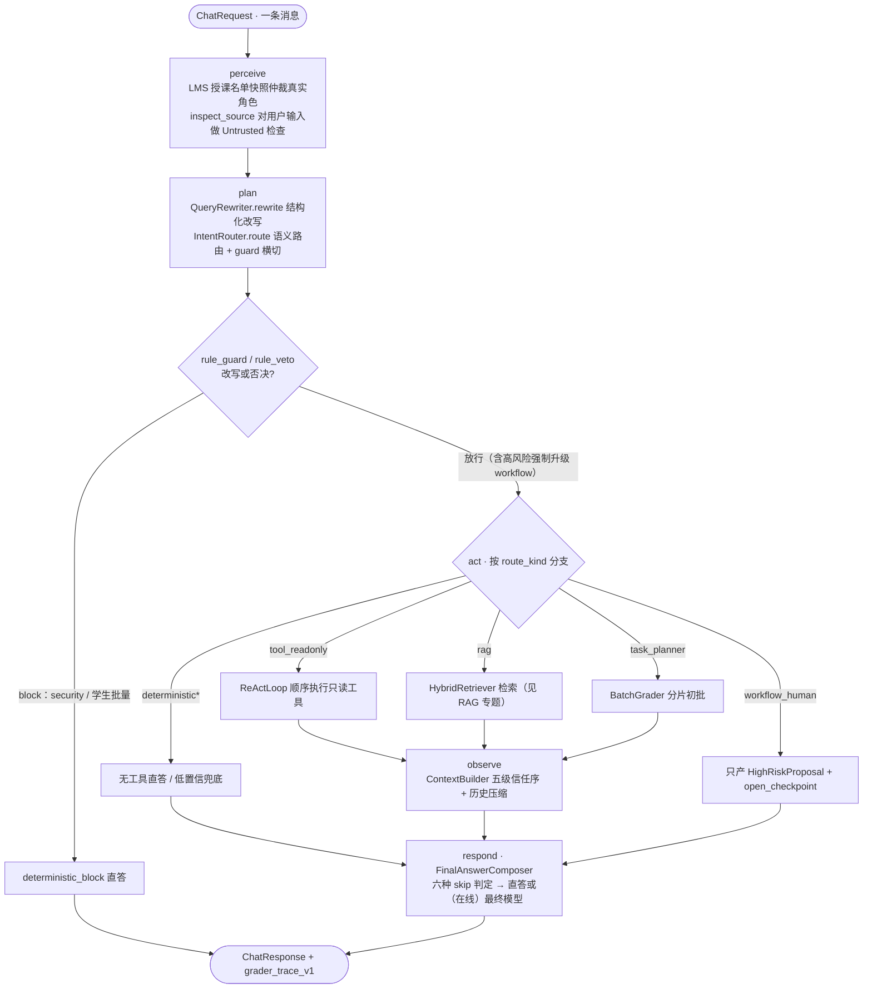
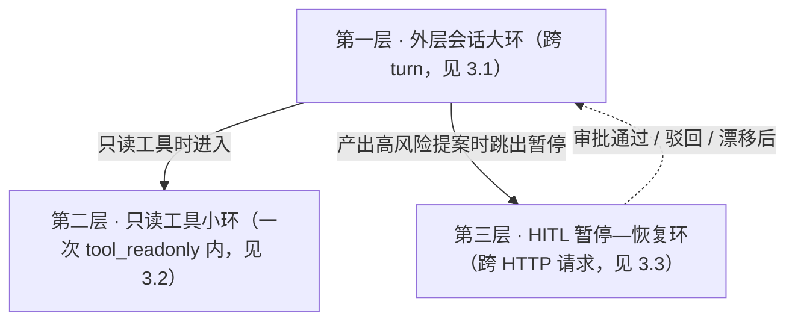
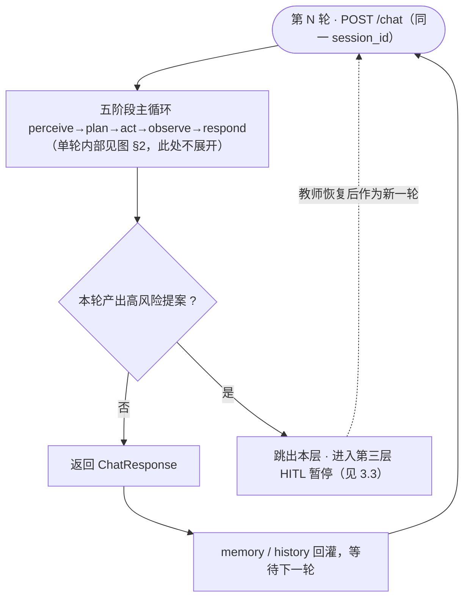
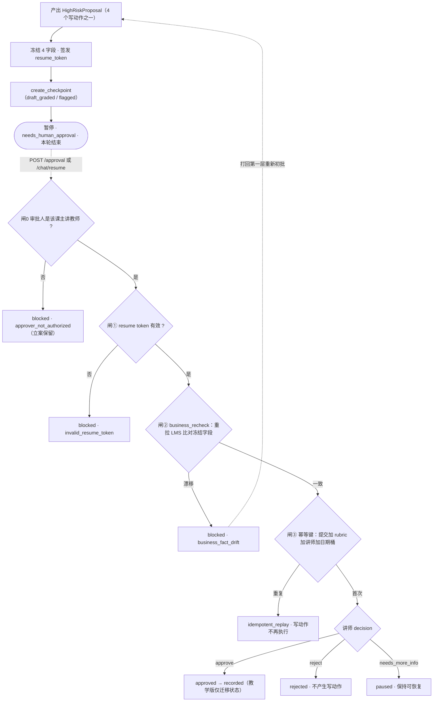
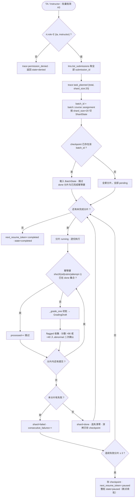

# Agent 设计：模型回路

> 这是 Grader 的 **Agent 专题文档**。agent 域是"模型被调用的地方"：意图怎么判、查询怎么改写、工具链怎么跑、批量怎么分片、最终答案在什么情况下**不**调模型。
>
> 返回 [项目首页 README](../README.md) ｜ 相关专题：[RAG 检索](./rag.md) ｜ [Harness 安全骨架](./harness.md) ｜ [工程实现](./engineering.md) ｜ [HTTP API](./api.md) ｜ [快速开始](./getting_started.md)

---

## 1. agent 域的边界

`agent/` 目录只放"模型回路"——一切会调用 LLM、或围绕一次模型调用做编排的逻辑。它**不知道怎么否决自己**：越权拦截、权限仲裁、防注入、审批闸、trace 脱敏都在 [`harness/`](./harness.md)。

| 文件 | 职责 |
|---|---|
| `loop.py` | `GraderAgent`：五阶段主循环 `chat()`、跨请求审批恢复 `resume()`、进程级单例 |
| `intent_router.py` | 12 intent 语义路由 + 受保护意图关键词安全网 + `rule_guard` / `rule_veto` 横切（守卫本体在 harness） |
| `query_rewrite.py` | `QueryRewrite` 结构化改写：指代消解 / 口语归一 / 子问题分解 |
| `react_loop.py` | 只读工具回路：按路由声明的工具顺序执行，白名单对账 |
| `final_answer.py` | `FinalAnswerComposer`：最终答案组装、六种 skip、`GradingDraft` / `HighRiskProposal` |
| `batch_mapreduce.py` | 批量初批：M1 单线程分片 + checkpoint；M2 map/reduce 留桩 |
| `llm.py` | `LLMClient` 双轨：在线 `with_structured_output` / 离线全部返回 `None` |

一句话：**agent 是模型的循环，[harness](./harness.md) 是决定循环何时停、能不能动手的安全骨架。**

---

## 2. 五阶段主 loop

`GraderAgent.chat()` 严格按 **perceive → plan → act → observe → respond** 顺序执行。阶段顺序是骨架：不允许在 act 阶段偷偷补一次模型调用，也不允许在 perceive 阶段做业务决策。



各阶段真实落点（`agent/loop.py`）：

1. **perceive**：`_build_runtime_context()` 调 `lms.get_instructor_roster(course_id)`，按授课名单快照把真实角色仲裁为 `instructor / ta / student`；用户自报的 `claimed_role` 仅记录到 `identity_conflicts`，不授权。随后对 `text` 做 `inspect_source("user_message", text, UNTRUSTED)`，写两条 trace：`perceive_input_received`、`context_source_safety_checked`。
2. **plan**：`QueryRewriter.rewrite()` → `IntentRouter.route()` 返回 `(RoutePlanCandidate, guard_meta)`。守卫改写时写 `rule_guard_overridden`；无论是否改写都写 `route_planned`。两道特例：① 候选计划出来后有一道**受保护意图关键词安全网**——安全 / 学术不端 / 申诉关键词命中而模型给了更弱意图时强制纠偏（`keyword_guardrail_<intent>`，详见 §4.3）；② `deferred_exam_query` 文本里出现"申请 / 提交 / 推荐"时，loop 内 `_escalate_deferred_exam()` 把它升级为 `workflow_human`。
3. **act**：一个 `try` 块按 `route_kind` 四分支；抛 `PermissionError` 时写 `permission_denied` 并走 `_deny_response()`；其他未预期异常写 `act_degraded` 并走 `_degraded_response()`（HTTP 200 降级直答、不产草稿 / 不开审批），保证单条坏输入不冒泡成 500。
4. **observe**：`ContextBuilder.build()` 组装五级信任序上下文并整体过一遍 PII 脱敏；`CostGovernor.build_cost_summary()` 记账。
5. **respond**：`FinalAnswerComposer.compose()` 决定直答还是调最终模型；`grading_request` 且产出 proposal 时，`_open_checkpoint()` 落 HITL 暂停点。末尾把白名单字段写入 `_memory`、把 user/assistant 两轮写入 `_history`。

### 2.1 总—分导航：五阶段 ↔ 本文分节

§2 是"总"，后面的章节是按阶段拆开的"分"；§3 则是把同一条主链路**竖着看**的循环嵌套视图（它不是第六个阶段）。第一次阅读建议先看 §2 与 §3 建立全貌，再按阶段查分节。

| 阶段 | 在本文的展开位置 |
|---|---|
| **perceive** | 本节已述（LMS 名单快照仲裁真实角色、对输入做 Untrusted 防注入）；跨轮记忆 / 历史回灌见 §10 |
| **plan** | **§4**：QueryRewrite 改写（§4.1）→ 12 intent 语义路由（§4.2）→ 守卫横切（§4.3） |
| **act** | **§5** 是四类分支总览；其中 `tool_readonly`（只读工具回路）细化见 **§6**，`task_planner`（批量初批）细化见 **§7**；`rag` 分支见 [RAG 专题](./rag.md)，`workflow_human` 分支见 [Harness · ApprovalGate](./harness.md#5-approvalgate高风险动作只提案不执行) |
| **observe** | 本节已述（ContextBuilder 五级信任序 + 历史压缩 + cost 记账）；信任序与冲突仲裁见 [Harness · ContextBuilder](./harness.md#6-contextbuilder五级信任序与冲突仲裁)，成本边界见 [Harness · 成本](./harness.md#9-成本治理的边界) |
| **respond** | **§8**：六种 skip 短路、最终模型润色、`GradingDraft` 结构化草稿 |

此外，LLM 在线 / 离线双轨是贯穿 plan / act / respond 的横切支撑（§9），记忆与会话回灌见 §10。

### 2.2 固定骨架还是自主循环？

外层 `chat()` 的 perceive→plan→act→observe→respond 是**确定性控制骨架（harness-controlled / scaffolded outer loop）**：顺序固定、由 harness 驱动，模型不能跳阶段、也不能自己决定何时停。模型的自主性只发生在**被授权的决策点内部**——plan 的语义路由只决定 intent（含置信度）、act 内只读工具回路按钉死的计划执行、respond 草稿生成；而 `route_kind` / 工具集 / 知识域 / 风险等级由确定性的 intent→plan 映射钉死，模型无权自填。

| 阶段 | 由谁驱动 | 模型能否决定走向 |
|---|---|---|
| perceive | harness | 否：固定做身份仲裁 + 信源安全检查 |
| plan | 模型（在线）/ 关键词表（离线降级） | 仅决定 intent + 置信度；route_kind / 工具 / 知识域由确定性映射钉死 |
| act | harness（按 route_kind 分派） | 仅 tool_readonly 内只读工具回路有模型选择 |
| observe | harness | 否：固定拼结构化上下文 |
| respond | 模型草稿（离线模板） | 是：生成话术；HITL 仍需人工 |

---

## 3. loop engineering：三层循环（逐层看）

Grader 的"循环"嵌套在三个尺度上，另有一条跨 HTTP 请求的暂停—恢复支路。模型不决定循环何时停——停不停、能不能写，由 guard、respond 的 skip 判定与 ApprovalGate 决定。

为避免一张图过大，下面**每层单独画一张小流程图**。注意与 §2 的分工：**§2 是"外层大环"在一条消息内的五阶段展开**，本节第一层不再重复五阶段内部，只画跨轮迭代与暂停/恢复跳转。

三层的包含与触发关系：



### 3.1 第一层：外层会话大环（跨 turn）

每条消息进入一次 §2 的五阶段；本层只关心跨轮的三件事：同一 `session_id` 下 `_memory` / `_history` 如何回灌进下一轮、什么情况下本轮会"跳出"到第三层暂停、教师恢复后如何作为新一轮回到主循环。



### 3.2 第二层：只读工具小环（tool_readonly 内）

仅当 `route_kind=tool_readonly` 时，act 进入 `ReActLoop`。plan 阶段已经钉死工具序列，环内不做"再决策"，只循环执行"取工具 → 白名单归一 / 剥离 → 声明对账 → 执行 → source_guard 清洗 → 判步数"；计划里任何非白名单"工具"（含模型发明的写动作）只剥离并留痕，不执行也不中断。4 个写动作不在工具表内，因此这一层**永远只读**；6 个工具清单与内置权限见 §6。


### 3.3 第三层：HITL 暂停—恢复环（跨 HTTP 请求）

grading 初批或 workflow 分支产出 `HighRiskProposal` 后，本轮就此暂停、不写 LMS；**讲师**经 `POST /sessions/{id}/approval` 或 `POST /chat/resume` 触发恢复，先过审批授权（loop 用授课名单快照确认审批人确为该课主讲教师），再连过三道闸。student / ta 可以发起立案，但持 token 审批只会得到 `blocked / approver_not_authorized`、立案保留。现场漂移时不是报错了事，而是打回第一层、以新一轮重新初批。冻结字段、状态机与幂等桶的完整定义见 [Harness 专题 · ApprovalGate](./harness.md#5-approvalgate高风险动作只提案不执行)。



---

## 4. plan：查询改写 → 语义路由 → 守卫横切

> 本节是五阶段中 **plan** 阶段的展开（总览见 §2）。

### 4.1 QueryRewrite 结构化改写

进路由之前，`agent/query_rewrite.py` 先把口语查询归一为 `QueryRewrite`（[契约字段见工程专题](./engineering.md#3-核心-pydantic-契约)）。

- **在线**：`llm.structured(QueryRewrite, prompt)` 直接绑定 schema，再用 runtime context / memory 补空实体（`_apply_coreference`）。
- **离线**（`GRADER_DISABLE_LLM=1`）：确定性正则——
  - 提交号 `\bS\d{3,4}\b`（如 `S1001`）；否则命中"上次 / 那个作业 / 这份 / 刚才"时回填 `memory.current_submission_id`；
  - 课程号 `\bCS\d{3}…\b`，否则取 runtime context 的 `course_id`；
  - 作业号 `\bA\d{1,3}\b`，否则"第 N 次/作业/题"归一为 `AN`，再否则回填 memory；
  - 含"批量 / 全部 / 所有 / 200份"时填 `sub_questions`；离线 `confidence=1.0`。

### 4.2 12 intent × route_kind 路由表

在线主分类用 `llm.with_structured_output(RoutePlanCandidate)` 叠加 few-shot 与置信度阈值 **0.7**，但**模型只决定 `intent` 与 `confidence`**：低于阈值不硬猜，落到 `low_confidence_query / deterministic_fallback` 追问澄清；置信度足够时，`route_kind / required_tools / knowledge_domains / risk_level` 一律由代码按下表（`_plan_for_intent`，在线 / 离线共用的权威映射）重新生成，模型自填的工具（例如它"发明"的 `grade_submission`）、路由类型或风险等级均不采信。无模型 / 解析失败 / 模型给出越界 intent 时，回落到离线关键词表。检索域以 RAG 专题的 `RAG_ROUTE_MAP` 为准。

| intent | route_kind | 计划工具 `required_tools` / RAG 域 | 备注 |
|---|---|---|---|
| `assignment_status_query` | `tool_readonly` | `get_submission`, `get_submission_timestamp` | 学生只能查本人（工具内二次校验） |
| `grading_request` | `tool_readonly` | `get_submission`, `get_rubric`, `check_similarity`, `get_student_history` | respond 阶段产 `GradingDraft` + `HighRiskProposal`，落 checkpoint |
| `rubric_query` | `rag` | 域 `rubric_knowledge` | |
| `syllabus_material_query` | `rag` | 域 `textbook_chapters` + `grading_sop` | 离线 plan 只声明 `textbook_chapters`，实际检索按 `RAG_ROUTE_MAP` 走两域 |
| `deferred_exam_query` | `rag` | 域 `grading_sop` | 文本含"申请/提交/推荐"→ loop 内升级 `workflow_human` |
| `grade_appeal` | `workflow_human`（high） | 不调工具，转人工 | 学生可发起申诉（立案）；审批改分仅讲师 |
| `academic_integrity_question` | `workflow_human`（high） | 转人工，系统不自动处分 | 学生 / ta 可发起咨询·举报（立案）；终判仅讲师 |
| `batch_grading` | `task_planner` | `list_submissions` + 分片初批 | 仅 ta / instructor（见 §7 权限说明） |
| `general_chat` | `deterministic` | — | 寒暄直答 |
| `degradation_request` | `deterministic` | — | 降级话术 |
| `low_confidence_query` | `deterministic_fallback` | — | 置信度不足，`ask_clarification` |
| `security_request` | `deterministic_block` | — | 守卫钉死，不交给模型理解 |

`RoutePlanCandidate` 用 Pydantic v2（`extra="forbid"`, `strict=True`）并带三条跨字段校验，任一不满足即抛错、由离线/兜底接住，绝不把非法计划喂给执行层：`required_tools` 非空必须 `needs_business_tools=True`；`knowledge_domains` 非空必须 `needs_rag=True`；`requires_workflow=True` 必须同时 `risk_level="high"` 且 `fallback_policy="workflow_first"`。此外两个 `field_validator(mode="before")` 先做形状归一：`required_tools` / `knowledge_domains` 里若混入 dict（`{"name": ..., "args": ...}`）或被序列化成 JSON 字符串的工具调用，统一由 `coerce_tool_name()` 提取出纯名字、去重并丢弃无法识别项。这是纵深防御的第一层——即便模型把 function-call 塞进工具列表，畸形结构也进不了执行层；是否允许执行再由执行层白名单判一次。

### 4.3 守卫横切（guard 本体在 harness）

`IntentRouter.route()` 的顺序是：先得到候选 plan → **受保护意图关键词安全网**（安全 / 学术不端 / 申诉关键词命中而模型给了更弱意图时，强制纠偏到受保护意图）→ `rule_guard(intent, rt)` → 高风险强制改写 → `rule_veto(plan, rt)`。守卫**否决的是模型的意图裁量权与计划**，不是润色文案。注意高风险 `workflow_human` 的**发起**对 student / ta 开放（申诉、学术不端咨询 / 举报只产提案、暂停等审批，无副作用），rule_veto 不拦发起；instructor 专属的终录 / 终判约束在审批端（§3.3 闸 0）。安全网的关键词与触发条件见 [Harness · §3.2](./harness.md#32-受保护意图模型不可降级关键词安全网)，守卫否决什么、在哪个时机见 [Harness · rule_guard / rule_veto](./harness.md#3-rule_guard--rule_veto一票否决)。

---

## 5. act：四类执行分支

> 本节是 **act** 阶段的总览；四个分支里，`tool_readonly`（只读工具回路）的细化在 §6，`task_planner`（批量初批）的细化在 §7。

| route_kind | act 行为 | trace |
|---|---|---|
| `tool_readonly` | `ReActLoop.run()` 返回 `tool_results / observations` | `tool_called` |
| `rag` | `HybridRetriever.retrieve(rewritten_query, intent)` | `rag_retrieved`（payload 含命中域集合） |
| `workflow_human` | `_act_workflow()` 产 `HighRiskProposal` + `open_checkpoint(state="flagged")` | `workflow_proposal_created`、`workflow_checkpoint_created` |
| `task_planner` | `_run_batch()`（ta/instructor，否则写 `permission_denied` 返回 `state:"denied"`） | `task_planned`、`shard_completed` |
| `deterministic*` | 无工具，直接进 respond | — |

---

## 6. 只读工具回路（ReActLoop）

> 本节是 **act** 阶段 `tool_readonly` 分支的细化（§5 四分支之一）。

Grader 的 ReAct 是**刻意收敛过的 ReAct**：模型不获得运行时自由增调工具的能力。

- 工具集合在 **plan 阶段就由确定性 intent 映射钉死**在 `RoutePlan.required_tools`；运行时 `ReActLoop.run()` 严格按这个顺序执行，最多 `RECURSION_LIMIT=6` 个、`TEMPERATURE=0.0`。
- 每个工具执行前过两道对账：① 先经 `coerce_tool_name()` 归一，必须在 6 个只读白名单内，**不在则剥离并记一条 `status:"blocked_not_whitelisted"` 的 observation（不执行、不抛错、不中断）**；② 必须出现在本次 `required_tools` 声明里，否则 `PermissionError`。这样即便计划里漏进模型发明的写工具，也只留痕，绝无 HTTP 500。
- 每个工具返回按 **Semi-trusted** 过 `source_guard`，再压缩成一条 observation：`{tool_name, args, output_summary, status, safety:{tainted, matched_pattern, sha256}}`；单工具异常被捕获、记为 `status:"error"` 后继续，不中断整链。

| 6 个只读白名单工具 | 作用 | 内置权限 |
|---|---|---|
| `list_submissions` | 列某作业全部提交 | — |
| `get_submission` | 取单份提交（含正文 / 状态 / 分数 / body_hash） | 学生只能取 `student_id == 自己`，否则 `PermissionError` |
| `get_rubric` | 取评分标准 | — |
| `get_student_history` | 取学生历史 | 学生只能查本人 |
| `check_similarity` | 取查重率（`flagged = similarity >= 0.8`） | 只读 |
| `get_submission_timestamp` | 取提交时间戳 | 只读 |

4 个高风险写动作（`record_final_grade` / `judge_academic_misconduct` / `recommend_deferred_exam` / `publish_feedback`）**物理上不在工具表**，因此模型在这一层"无手可写"，只能在 respond 阶段产出 `HighRiskProposal`。

> **演进项（在线 native tool-calling）**：当前 `ReActLoop` 无论在线/离线，运行时都是"按 plan 声明顺序执行"的确定性回路。这是有意的安全收敛——在线时模型只决定 intent，用哪些只读工具由确定性 intent 映射钉死（结构化输出 + 契约形状归一 + 守卫 / 白名单对账），执行顺序仍由 harness 控制。在线 LangChain native tool-calling 的自主多轮 think-act 回路是 Roadmap 上的预期强化项（见 [工程专题 Roadmap](./engineering.md#10-roadmap)），落地时会另开分支、不改变当前顺序确定性行为。

---

## 7. task-planner：批量初批

> 本节是 **act** 阶段 `task_planner` 分支的细化（§5 四分支之一）。

200 份作业的批量初批由 `agent/batch_mapreduce.py` 承担，分两档演进。

### 7.1 M1：单线程分片 + checkpoint（已实现）

`BatchGrader.run_batch(course_id, assignment_id, submission_ids, runtime_context, rubric_version="v1.0", shard_size=20)`：



关键规则（均与代码一致）：

- **幂等键** = `sha256(submission_id | rubric_version | attempt-id)` 前 16 位，已完成的提交重跑时只累加计数、不重复初批。
- **失败熔断**：一个分片内任意一份抛错则该分片 `failed`、`consecutive_failures += 1`；**连续 3 个分片失败**则存 checkpoint、`next_resume_token=batch::…:paused`、整批 `paused` 返回；成功分片把连失计数清零，且**每完成一个分片就深拷贝落一次 checkpoint**。
- **lead 校准（M1 范围）**：合并 `flagged` 名单，把 `overall_score > 98` 或 `< 40` 的异常分放入 `abnormal` 待二次确认；跨分片 ±1 分校准留 M2。
- loop 侧返回 `session_state.batch`：`{batch_id, total_shards, shard_size:20, processed_shards, state, checkpoint_id:next_resume_token, parallelism:1, total, processed, failed}`。

> **批量已绑定真实主 loop**：`GraderAgent` 构造时 `self.batch_grader = BatchGrader()` 后立即 `self.batch_grader.bind(self.chat)`，因此 M1 的分片 / checkpoint / 幂等 / 熔断机制真实运行，且每份 `_grade_one` 都回调主 loop 的真实单份初批（离线走 `deterministic_score` 按 rubric 关键词打分）。种子数据已补足到 25 份提交，`shard_size=20` 时产生 2 个分片（20+5）。

### 7.2 M2：多 agent map/reduce（留桩）

`MapReduceBatchGrader` 的 `map_shard / reduce_leads / run_parallel(parallelism=4)` 方法签名完整，**函数体与构造器一律 `raise NotImplementedError("M2: multi-agent map/reduce not implemented")`**，不影响 M1 运行。M2 目标：分片并行初批 → lead 汇总横向校准，且 lead 只建议 ±1 分以内调整、无权推翻分片初批。

---

## 8. respond：最终答案、六种 skip 与 GradingDraft

> 本节是五阶段中 **respond** 阶段的展开（总览见 §2）。

`FinalAnswerComposer.compose()` 在调最终模型之前按顺序短路，**六种 skip 命中其一就不调最终模型**：

| # | skip 场景 | 真实落点 |
|---|---|---|
| 1 | `security_blocked` | `route_kind=deterministic_block` 或 intent=`security_request` → 固定拦截话术 ✅ |
| 2 | `deterministic_short_circuit` | `general_chat / degradation / low_confidence / task_planner` 直答 ✅ |
| 3 | `awaiting_human_approval` | grading / workflow 分支直接返回草稿话术与提案，不调最终模型 ✅ |
| 4 | `tool_empty_or_error` | `tool_readonly` 但没有工具结果，或（非 grading）无一条 `success` → 降级话术 ✅ |
| 5 | `tainted_source_redacted` | 作业正文命中注入时，答案前缀 `[tainted-source-redacted]`，**仍按 rubric 正常打分**、不回显攻击原文 ✅ |
| 6 | `cost_budget_truncated` | 演进项：`CostGovernor` 已提供预算判定与记账，超预算触发点随在线接入补齐（见 [工程专题 Roadmap](./engineering.md#10-roadmap)） ⏳ |

只有 `rag` 分支在**在线模式**会调用一次 `llm.generate(render_system_prompt({needs_rag, route_kind:"rag"}), …)` 润色；离线 `generate()` 返回 `None`，使用"依据{域}：{top chunk}"的确定性话术。

### GradingDraft：结构化批改草稿 = 评分可重放的前提

`grading_request` 的草稿以 `with_structured_output(GradingDraft)` 为目标结构（离线由 `deterministic_score()` 按 rubric 关键词确定性打分，温度 0、可重放）。草稿逐 rubric 条目产出：

```
GradingDraft { submission_id, rubric_version,
  items: [ { rubric_item_id, score, max_score, reason, cited_chunk_hash } ... ],
  overall_score, draft_feedback, flagged, flagged_reasons[] }
```

- 每个条目带 `rubric_item_id` + 条目分 + 理由 + 引用作业段落的 `cited_chunk_hash`（离线为正文前 200 字的 sha12）；
- 整体绑定 `rubric_version`，`flagged` 由查重阈值或注入命中触发；
- 同时产出 `HighRiskProposal(action="record_final_grade", frozen_fields=…)`，冻结字段由提交/查重现场组装。

正因为模型不能自由写一段散文式评语、而是填一张结构化的表，事后才能沿"**总分 → 各 rubric 条目 → 对应作业段落 hash → rubric 版本**"完整复算每一分的来历：支持申诉逐条核对、支持公平性双跑对齐维度、学生偷换提交版本时可凭 hash 立刻发现。没有结构化草稿，分数只是一段无法被机器解析的文本，可重放与公平性 eval 都无从谈起。

> 注意：教学版里 `recorded` 只迁移审批状态机，**不真正回写 LMS**（见 [免责声明](../README.md#免责声明)）。

---

## 9. LLM 双轨

`agent/llm.py` 的 `LLMClient` 在构造时按 `GRADER_DISABLE_LLM` 固定模式：

- **离线**（`=1`）或**无有效 key**（缺失 / 占位串 `placeholder`、`sk-xxx`）：`structured()` 与 `generate()` 一律返回 `None`，调用方回落到确定性规则；缺 key 不报错、也**不因此跳过任何 guard**。
- **在线**：延迟导入 `langchain_openai.ChatOpenAI`（默认模型 `Qwen/Qwen3-8B`、温度 0、超时 20s、OpenAI 兼容 base_url），`structured()` 即 `llm.with_structured_output(PydanticModel).invoke(prompt)`，异常时吞掉并返回 `None` 走兜底。

三处结构化输出绑定：路由 `RoutePlanCandidate`、改写 `QueryRewrite`、批改 `GradingDraft`；自由文本 `generate()` 仅用于 RAG 答案润色。模块不缓存 prompt 正文、不混入动态学生数据。

---

## 10. 记忆与会话回灌

- `_memory[session_id]` 只白名单存两个字段：`current_submission_id`、`current_assignment_id`；不存作业原文、姓名、学号、草稿分数。
- `_history[session_id]` 追加 user / assistant 两条消息，喂给下一轮路由与 `ContextBuilder` 的历史压缩（token 预算 4000，超限时从最旧的 tool observation 开始压缩）。
- 进程级单例 `get_grader_agent()` 持有这些内存态；**eval runner 的多轮 case 每轮使用不同的子 session id（`<case>-s{i}`）**，因此离线回归里 memory 不跨轮共享，这是评测隔离的有意设计，不是 bug。

---

## 11. agent 域实现状态一览

| 能力 | 状态 | 说明 |
|---|---|---|
| 五阶段主 loop / resume 审批授权 + 三闸 | ✅ 已接线 | 本文 §2、§3；非讲师持合法 token 审批被 `approver_not_authorized` |
| 语义路由 + 结构化输出 + 阈值兜底 | ✅ 在线路径 | 离线关键词表完整；在线需有效 key，当前未用真实 key 实测 |
| QueryRewrite 指代消解 | ✅ | 在线 structured / 离线正则 |
| 只读工具回路（白名单 + 对账 + ≤6） | ✅ | 顺序执行的确定性 ReAct |
| LangChain native tool calling 自主多轮回路 | ⏳ 演进项 | 在线预期强化项，当前顺序确定性执行是有意安全收敛 |
| GradingDraft 结构化草稿 + 确定性打分 | ✅ | 离线 `deterministic_score` |
| 六种 skip | ✅ 5 / ⏳ 1 | `cost_budget_truncated` 记账已在、超预算触发点待接（演进项） |
| 批量 M1 分片 / checkpoint / 幂等 / 熔断 | ✅ | 已 `bind(self.chat)`，每份走真实单份初批（25 份种子 → 2 分片） |
| 批量 M2 map/reduce | ⏳ 留桩 | `NotImplementedError` |
| 记忆 / 历史 / 单例内存态 | ✅ | 教学版无持久化（见 [工程专题](./engineering.md#6-状态持久化与生产化缺口)） |
