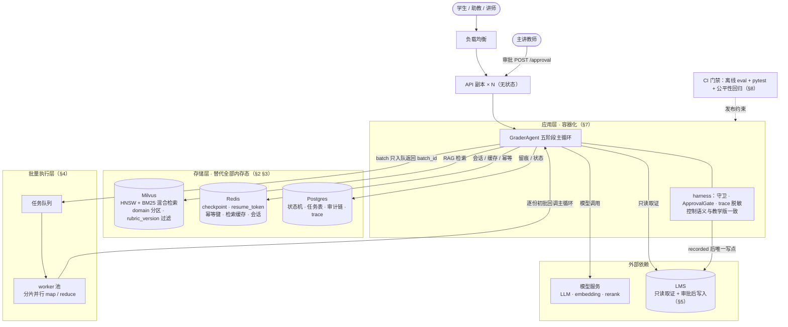

# 生产化升级方案

> 这是 Grader 的 **工程专题文档**。它**不介绍当前实现**——当前实现见 [Agent](./agent.md) / [RAG](./rag.md) / [Harness](./harness.md) 专题与代码——只回答一个问题：**把教学版推向生产，要补哪些目前没有实现的能力**。每项给出动机、目标形态与要点，均未实现。
>
> 返回 [项目首页 README](../README.md) ｜ 相关专题：[Agent 模型回路](./agent.md) ｜ [RAG 检索](./rag.md) ｜ [Harness 安全骨架](./harness.md) ｜ [快速开始](./getting_started.md)

---

## 1. 现状定位：教学版与生产的差距

教学版为了"离线可跑、行为可断言"做了三个刻意取舍：**全内存、单进程、不写 LMS**。它们换来零依赖的可回归性，也画出了生产化的边界：

| 维度 | 教学版现状 | 生产目标 |
|---|---|---|
| 向量存储 | 进程内 `dict[domain] -> list[Chunk]`，重启重建 | Milvus 等独立向量库，索引持久化、可扩展 |
| 状态 | trace / checkpoint / 幂等键 / 批量进度 / 会话全部内存态 | Redis / 数据库持久化，进程重启不丢 |
| 批量执行 | HTTP 请求内单线程同步跑分片 | 任务队列 + 分片并行 map/reduce |
| LMS 写路径 | `recorded` 只迁移状态机，不回写成绩系统 | 审批通过后对接真实写接口（带对账与审计） |
| 模型回路 | 只读工具按计划顺序确定性执行 | 在线 native tool-calling 自主多轮等强化 |
| 可观测 | 内存 trace，按 session 查询 | trace 落库、审计报表、告警 |
| 部署 | 单进程 uvicorn，配置靠 `.env` | 容器化、水平扩展、密钥管理 |

安全红线在升级中**不变**：六种 skip、审批授权闸 + 三道闸、trace 递归脱敏、Untrusted 输入信任序、成本不跳业务事实与 HITL——升级只换存储与执行介质，不换控制语义（见 [CLAUDE.md §10.3](../CLAUDE.md)）。

### 1.1 目标技术架构总览

升级完成后的目标形态一张图（各方框标注对应的升级章节；应用层的五阶段循环与 harness 控制语义和教学版完全一致，变的是底下接的东西）：

读图要点：**API 层无状态化（§7）是水平扩展的前提**，而它又依赖存储层先把 checkpoint / 幂等键 / 会话全部外置（§3）——否则多副本各持一份闸的状态，幂等闸就会失效；**对 LMS 的写路径只有一条**（harness 在 `recorded` 之后），审计链与对账回读都挂在这个唯一写点上（§5）；批量从"HTTP 请求内同步执行"改为"入队 + worker 池消费"（§4），worker 逐份初批仍回调同一个主循环，控制语义不因并行而旁路。

---

## 2. 向量存储升级：引入 Milvus

**动机。** 内存索引在知识量到教材级（数千 chunk × 多课程）后有四个硬伤：每次重启全量重建与重新向量化；余弦相似度是 Python 线性扫描，无法水平扩展；无法按 rubric 版本管理多套索引；关键词路无法下推到存储层做真正的 BM25。

**目标形态。** 引入 Milvus 作为向量存储：

- **集合设计**：一个 collection，字段 `chunk_id (PK) / domain / rubric_version / text / metadata(JSON) / dense_vector / sparse_vector`；`domain` 做 partition key，`rubric_version` 做标量过滤字段；
- **混合检索下推**：稠密向量走 HNSW 索引、稀疏向量走 BM25（Milvus 2.4+ 原生 hybrid search），把现在应用层的"双路召回 + RRF"下推到存储层并行执行，RRF 融合与来源权重重排仍在应用层——`HybridRetriever` 只换数据访问层，检索行为（citation、rerank、缓存）不变；
- **索引版本管理**：按 `rubric_version` 过滤或分 collection，rubric 升级时新版本建好、灰度切换、旧版本保留可回滚——现在的 `IndexCache` 预留位即为此设计；
- **一致性约束**：知识文档变更走重建管道（全量切块 → 新版本写入 → 原子切换 → 清检索缓存），chunk_id 的 sha256 指纹规则不变，保证 citation 仍可追溯。

**前置改造。** 索引构建与检索解耦成独立模块；embedding 批量化（Milvus insert 支持批量，逐条 `/embeddings` 调用是瓶颈）；切片参数按教材语料重调（当前 500/50 适配 rubric 条目级知识）。

---

## 3. 状态持久化

**动机。** 教学版全部状态在进程内存：重启即丢，意味着教师审批到一半的 checkpoint 消失、幂等键失效可能重复执行、trace 无法事后审计。生产化第一件事是把状态外置。

| 内存态 | 位置 | 生产化方案 |
|---|---|---|
| HITL checkpoint、resume_token | `ApprovalGate._checkpoints` | Redis（token 带 TTL，审批挂起超时自动失效） |
| 幂等键 → 已执行结果 | `ApprovalGate._executed` | Redis / DB 唯一键，**保留时间必须长于业务对账周期**（当前的"UTC 天桶"教学简化改为显式 TTL） |
| 单份状态机 `GradeGraphState` | `ApprovalGate._states` | Postgres 行级记录 + 状态迁移事务 |
| 批量 BatchState / 分片 checkpoint | `BatchGrader._checkpoints` | 任务表 + 进度表（见 §4） |
| 会话 memory / history | `GraderAgent._memory / _history` | 会话存储（Redis hash / DB），history 压缩策略不变 |
| trace 事件 | `TraceStore` dict | 时序库或对象存储，写入前脱敏语义不变，追加按 session_id / 时间双索引 |
| 检索缓存 | `RetrievalCache` 实例 dict | Redis，键规则（intent::query）与失效策略不变 |

**关键约束**：恢复三道闸、冻结字段比对、幂等判定的**逻辑一行不改**，只换介质；business_recheck 仍必须实时拉 LMS 现场比对，持久化不等于可以拿库里的旧值充数（成本红线第 1 条）。

---

## 4. 批量执行与任务调度

**动机。** 当前批量初批在 HTTP 请求线程内单线程同步执行（`parallelism=1`）：200 份的真实作业量会超时；进程重启丢进度（内存 checkpoint）；分片失败重试靠人工再发一次请求。

**目标形态。**

- **队列化**：`POST /chat` 对 `batch_grading` 只入队返回 `batch_id`，worker 池消费分片；`BatchState` 落任务表，前端轮询 / 推送进度；
- **分片并行（M2 map/reduce）**：分片并行初批（map），lead 汇总横向校准（reduce）——lead 只建议 ±1 分以内的调整、无权推翻分片初批，这个确定性约束随并行度一起落地；`MapReduceBatchGrader` 的方法签名已预留；
- **失败治理**：分片级重试策略与退避、连续失败熔断阈值保留、死信队列人工介入；
- **断点续批**：checkpoint 持久化后，重启 worker 从任务表恢复，幂等键（`submission_id | rubric_version | attempt-id`）保证已完成提交不重复初批；
- **成本控制**：批量间复用 rubric / 政策的检索结果（同 query 命中实例级缓存即可，跨 worker 时把该缓存放 Redis）。

---

## 5. LMS 写路径对接

**动机。** 教学版的 `recorded` 只迁移内存状态机，`recorded_actions` 只是"被授权的动作清单"。真实生产中成绩必须落到 LMS，而这恰恰是全系统唯一不可逆的外部副作用，也是 HITL 存在的意义。

**目标形态。**

- **写入点唯一**：真实写调用只发生在 ApprovalGate `recorded` 之后——四道闸全过才有资格写，这条不变；
- **对账回读**：写入后回读 LMS 校验（写入分数 = 提案分数 = 草稿分数），不一致触发告警与人工处理；
- **失败补偿**：写 LMS 失败时的重试 / 补偿语义要明确（幂等键已在闸 3 保证不重复执行，需扩展为"LMS 侧幂等"：带客户端令牌的 upsert）；
- **审计链**：每次写入落审计记录（谁批的、批的是哪份冻结现场、trace 事件链），与 `grader_trace_v1` 脱敏事件并存——审计记录含 instructor_id 但不含学生 PII 明文；
- **写权限收敛**：服务对 LMS 的写凭证与只读凭证分离，最小授权。

---

## 6. 模型回路强化

当前"顺序确定性执行"是有意的安全收敛；在线能力按以下顺序放开，每步都保留对账与守卫：

- **在线 native tool-calling 自主多轮 ReAct**：让模型在只读白名单内自主决定多轮工具序列（仍限 6 个只读工具、温度 0、recursion_limit 6、与 RoutePlan 对账不变）——从"钉死顺序"升级为"白名单内自主"；
- **prompt 统一从 registry 渲染**：路由与查询改写的内联 few-shot prompt 迁入 `harness/prompts/` registry，trace 只记片段 ID（机制已就绪，接线待做）；
- **成本预算截断接线**：`CostGovernor.token_budget_check()`（80% 告警 / 100% 停止）与 `observation_compression()` 已实现，把超预算触发点接入 loop，补齐第 6 种 skip `cost_budget_truncated` 的运行时触发；
- **`GRADER_FIXED_DATE`**：固定基准日期，让时间相关判定（迟交、日期桶幂等键）可复现；
- **在线真实 key 实测**：语义路由、结构化改写、GradingDraft、rerank API 的在线路径均需真实模型服务回归一遍，并补充在线模式的 eval 断言集。

---

## 7. 部署、可观测与安全

- **无状态化后水平扩展**：内存单例（agent / retriever / trace store / approval gate）全部外置（§2、§3）后，API 层才是无状态的，才能多副本；扩展前必须先完成状态外置，否则多副本各自持有 checkpoint 与幂等键，闸 3 会失效；
- **配置与密钥**：`.env` 换配置中心或至少容器化 secret 注入；LMS service token、LLM key 独立轮转；
- **可观测**：trace 落库后补仪表盘（审批耗时、漂移率、拦截率、缓存命中率、批量失败率）；对"守卫拦截"与"审批漂移"设告警——它们是系统在正确工作的信号，静默才是异常；
- **合规**：真实学生数据接入前完成 PII 处理评审（脱敏规则已就绪，但需要数据分级与保留策略）、访问审计与授权流程。

---

## 8. 回归与发布

- **CI 门禁**：每次提交跑离线 eval 21 case（`GRADER_DISABLE_LLM=1` 三开关）+ pytest 全量 + markdownlint，作为合并门禁；
- **升级不破坏行为**：§2–§5 的每一步存储 / 执行介质替换，都要求离线 eval 输出与升级前一致（行为等价回归），控制语义变化单独走 PR 并加 `[guardrail-touch]` 标记；
- **灰度与双跑**：LMS 写路径上线采用"双跑对账"——新旧路径并行、以旧成绩簿为对账基准，一致率达标后切换；
- **公平性回归进 CI**：`consistency_check`（同文不同署名分差 ≤ 2）在模型 / prompt / rubric 任何一项变更时必须重跑，作为发布前检查项。
