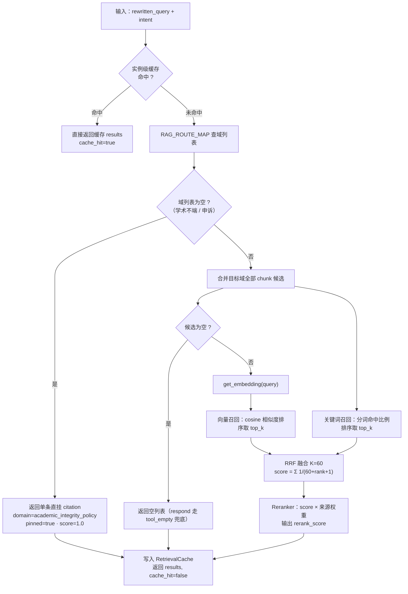
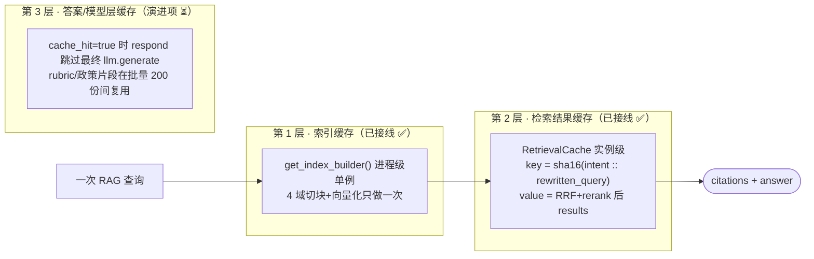

# RAG 设计：知识检索

> 这是 Grader 的 **RAG 专题文档**：知识切成哪几个域、检索怎么路由与融合、embedding 怎么做在线/离线双轨、缓存分几层、学术不端政策为什么不走向量召回。
>
> 返回 [项目首页 README](../README.md) ｜ 相关专题：[Agent 模型回路](./agent.md) ｜ [Harness 安全骨架](./harness.md) ｜ [工程实现](./engineering.md)

---

## 1. rag 域的边界

RAG 只负责"把正确的知识片段找出来"，不决定要不要据此作答、更不持有任何写动作。

| 文件 | 职责 |
|---|---|
| `knowledge/*.md` | 知识源：4 个索引域 + 1 个直挂域，均带 frontmatter |
| `build_index.py` | 解析 frontmatter、切块、向量化，构建进程内索引 |
| `embedding.py` | embedding 双轨：在线 OpenAI 兼容接口 / 离线 256 维确定性向量 |
| `hybrid_retrieval.py` | intent 域路由 + 向量/关键词双路召回 + RRF 融合 + 实例级检索缓存 |
| `rerank.py` | 按来源权重的确定性重排器（已接入 `retrieve()` 末尾，见 §6） |
| `cache.py` | `RetrievalCache`（已接线，见 §7）/ `IndexCache`（未启用，按版本换索引预留） |

---

## 2. 4 + 1 知识域

4 个域各建一个向量索引，由 intent 决定检索哪些域；另有 1 个域**不进向量索引**，作为预检索直挂政策。

| 域（domain） | 知识文件 | 服务 intent（`RAG_ROUTE_MAP`） | 是否向量索引 |
|---|---|---|---|
| `rubric_knowledge` | `rubric_knowledge.md` | `rubric_query`；`grading_request` | 是 |
| `textbook_chapters` | `textbook_chapters.md` | `syllabus_material_query`；`grading_request` | 是 |
| `exemplar_essays` | `exemplar_essays.md` | `grading_request` | 是 |
| `grading_sop` | `grading_sop.md` | `syllabus_material_query`、`deferred_exam_query`、`grading_request` | 是 |
| `academic_integrity_policy` | `academic_integrity_policy.md` | `academic_integrity_question`、`grade_appeal` | **否，预检索直挂** |

```python
RAG_ROUTE_MAP = {
  "rubric_query": ["rubric_knowledge"],
  "syllabus_material_query": ["textbook_chapters", "grading_sop"],
  "grading_request": ["rubric_knowledge", "exemplar_essays", "grading_sop"],
  "deferred_exam_query": ["grading_sop"],
  "academic_integrity_question": [],   # 直挂政策，不向量召回
  "grade_appeal": [],                  # 直挂政策，不向量召回
}
PINNED_DOMAIN = "academic_integrity_policy"
```

**为什么政策要直挂而不是走向量相似度**：学术不端政策是必须**逐条、确定、完整**呈现的硬约束，不能因为与学生措辞"不够相似"就漏召回，也不该被其他片段稀释。因此它不参与向量/关键词打分，而是在对应分支确定性地 append 一条固定 citation（`pinned=True, score=1.0, retrieval_stage="pre_retrieval"`）。

> **高风险分支直挂政策**：`grade_appeal / academic_integrity_question` 走 `workflow_human`，`loop._act_workflow()` 在创建 `HighRiskProposal` 的同时**确定性 append** 这条 pinned citation（`policy_id=academic_integrity`），并入 response 的 `citations` 字段与 trace（`policy_citation_pinned` 事件）。无论提问措辞如何，政策都完整在场，不依赖相似度召回。

---

## 3. 检索链路（hybrid + RRF）

`HybridRetriever(top_k=5)` 的实际流程：



- **向量召回**：query 与 chunk 都过 `get_embedding`，用余弦相似度排序。
- **关键词召回**：`_keyword_score` 把 query 按非字母数字切词、统计命中文本的词比例（对中文是字符/子串级的简易匹配），弥补精确术语（"迟交""缓考""O(n log n)"）的向量召回。
- **RRF 融合**：常量 `RRF_K=60`，对 chunk 在两路中的排名累加 `1/(K+rank+1)`。
- **来源权重重排**：RRF 融合后由 `Reranker` 按域权重（rubric/policy=1.0、exemplar=0.85、textbook=0.8、sop=0.7）二次打分，输出 `rerank_score` 后取 top_k。

返回元素：`{chunk_id, text, domain, score, rerank_score, pinned:false, metadata}`。respond 阶段把它映射为对外 citation：`{source:domain, title:metadata.title||chunk_id, score, retrieval_stage:"tool_retrieval"}`；直挂域的 `retrieval_stage="pre_retrieval"`。离线模式 citation 不含 snippet 文本。

> **缓存命中时**：`retrieve()` 返回 `(results, cache_hit=True)`，loop 写 `cache_hit` trace 并在 respond 阶段跳过最终模型（`model_answer_skipped`），详见 §7。

---

## 4. 索引构建与切块

`build_index.py` 在首次取用时构建一次内存索引：

1. 逐个读取 4 个索引域 md（直挂域被 `INDEX_DOMAINS` 显式排除）；
2. `_parse_frontmatter` 解析开头的 `--- key: value ---`，元数据并入每个 chunk 的 `metadata`（并加 `chunk_index`）；
3. `_chunk_text` 按空行分段、贪心打包到 **`CHUNK_SIZE=500`** 字符，相邻块重叠 **`CHUNK_OVERLAP=50`** 字符；
4. 每个 chunk 计算 `chunk_id = sha256(domain::chunk_index::正文前64字)[:16]` 与 `vector = get_embedding(text)`；
5. 结构为内存字典 `dict[domain] -> list[Chunk]`。

---

## 5. embedding 在线 / 离线双轨

`rag/embedding.py` 的 `get_embedding(text)` 提供同一接口、两种后端：

- **在线**（默认）：`POST {GRADER_LLM_BASE_URL}/embeddings`，模型取 `GRADER_EMBEDDING_MODEL`（默认 `BAAI/bge-m3`），Bearer 鉴权、超时 10s；任何异常都**回退离线向量**，保证核心链路可跑。
- **离线**（`GRADER_OFFLINE_RAG=1`，或在线失败）：`_offline_embedding` 用文本 SHA-256 摘要反复哈希扩展到 **256 维**，每字节线性映射到 `[-1,1]` 后做 L2 归一化。它没有语义理解能力，但**同一段文本永远得到同一个向量**，因此检索结果确定、可字节级复跑——足以验证"路由是否正确、是否走了 RAG、命中哪个域"这些工程行为。

双轨的意义：离线三开关下不依赖任何网络与密钥就能跑通检索与全部 eval；切到在线只换向量后端，索引结构、域路由、RRF、citation 契约都不变。

---

## 6. 重排器（已接线）

`rerank.py` 的 `Reranker` 按来源权重做确定性二次重排：`final = rrf_score × DOMAIN_WEIGHT[domain]`，权重为 `rubric_knowledge=1.0`、`academic_integrity_policy=1.0`、`exemplar_essays=0.85`、`textbook_chapters=0.8`、`grading_sop=0.7`，输出新增 `rerank_score` 字段后取 top_k。

- **接线位置**：`HybridRetriever.retrieve()` 在 RRF 融合之后、取 top_k 之前调用 `Reranker().rerank(fused, top_k=self.top_k)`；在线/离线行为都确定，不影响双轨。离线 eval 只断言命中文域与缓存命中，不断言脆弱的片段顺序。

---

## 7. 缓存设计

缓存按"越靠上越便宜、越易失效"分两层已落地、一层为演进项。



### 第 1 层：索引缓存（✅ 已接线）

`get_index_builder()` 是模块级单例，`IndexBuilder.build()` 内部 `if self._index: return self._index`。一个进程内 4 个域的切块与向量化只发生一次，之后所有检索复用同一索引。离线模式下这是最主要的"省算力"来源。

### 第 2 层：检索结果缓存（✅ `RetrievalCache` 已接线）

`cache.py` 的 `RetrievalCache` 是 `dict[query_hash] -> list[result]`：

- 键 = `sha256(f"{intent}::{query}")[:16]`（**把 intent 纳入键**，同一句问 rubric 与问大纲不会串结果）；
- 提供 `get / set / invalidate(query,intent) / clear`。

已接入 `HybridRetriever.retrieve()` 首尾：开头先 `cache.get(query,intent)`，命中则直接返回 `(results, cache_hit=True)`；未命中走完 hybrid + RRF + rerank 后 `cache.set(...)`。它挂在 **retriever 实例级而非 session 级**——eval runner 的多轮 case 每轮用不同子 session id，但同一 agent 共享一个 retriever，这样重复问句仍能命中。

### 第 3 层：答案层 / 跨批量复用（⏳ 演进项）

- 检索命中缓存时，respond 的 RAG 分支**跳过 `llm.generate`**：loop 把 `cache_hit` 透传到 `FinalAnswerComposer._rag_answer`，在线时不重复润色，并写 `model_answer_skipped` trace（对应 [Agent 专题](./agent.md#8-respond最终答案六种-skip-与-gradingdraft) 中"缓存命中跳过最终模型"的 skip 语义）。
- 批量批改（200 份）之间，rubric 与政策片段对所有学生是同一份，应在批量上下文里复用检索结果，避免每份重复检索同一条评分标准（随 M2 批量并行落地）。

### 失效策略（设计约束）

- 知识文件 / rubric 版本变更 → 重建第 1 层索引并清空 `RetrievalCache`；
- 检索缓存只缓存**公共知识结果**，绝不缓存带学生身份、作业正文的结果（那些不是纯 query→knowledge 映射）；
- 缓存只能省"模型的话与重复检索"，**不能省业务事实核对与 HITL**（见 [Harness · 成本治理](./harness.md#9-成本治理的边界)）。

### 关于 `IndexCache` 与 eval case

`cache.py` 另有一个单值 `IndexCache`（`get/set/invalidate`），当前索引缓存实际由 `get_index_builder()` 单例承担，`IndexCache` 类未被引用——保留它是为多版本索引（按 rubric 版本换索引）预留，本文不宣称它生效。名为 `grader-rubric-query-rag-cachehit` 的 eval case 已升级：第二轮断言 `session_state.rag.cache_hit=true`、trace 含 `cache_hit` 与 `model_answer_skipped`，且仍不碰业务工具。

---

## 8. rag 域实现状态一览

| 能力 | 状态 | 说明 |
|---|---|---|
| 4 域向量索引 + frontmatter + 切块 | ✅ | size 500 / overlap 50 |
| intent 域路由 | ✅ | `RAG_ROUTE_MAP` |
| 向量 + 关键词双路召回 | ✅ | cosine / 命中比例 |
| RRF 融合（K=60） | ✅ | 融合后交 Reranker 二次重排 |
| embedding 在线 / 离线双轨 | ✅ | 离线 256 维确定性向量，在线失败自动回落 |
| 索引进程级单例缓存 | ✅ | 第 1 层 |
| `Reranker` 来源权重重排 | ✅ | 已接入 retrieve 末尾，输出 rerank_score |
| `RetrievalCache` 检索结果缓存 + 命中跳模型 | ✅ | 已接线，挂实例级；命中透传 `rag.cache_hit` 并 `model_answer_skipped` |
| 高风险路径直挂政策 citation | ✅ | `_act_workflow` 确定性 append，并入 citations 与 trace |
| 跨批量 rubric/政策片段复用 | ⏳ | 演进项，随 M2 批量并行落地 |
