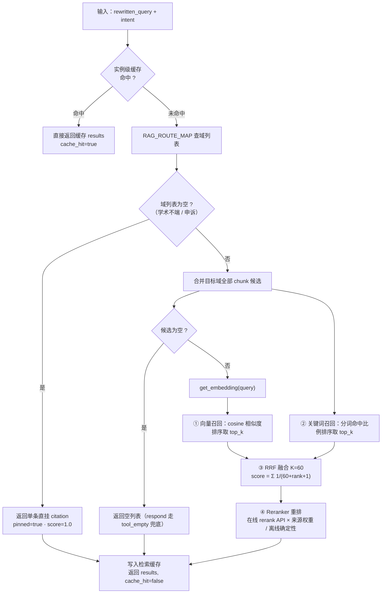
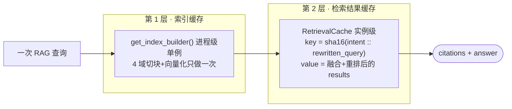

# RAG 设计：知识检索

> 这是 Grader 的 **RAG 专题文档**：知识切成哪几个域、切片怎么切、检索原理（双路召回 → RRF 融合 → 重排）、rerank 与 embedding 的在线 / 离线双轨、缓存分几层、学术不端政策为什么不走向量召回。
>
> 返回 [项目首页 README](../README.md) ｜ 相关专题：[Agent 模型回路](./agent.md) ｜ [Harness 安全骨架](./harness.md) ｜ [生产化升级方案](./engineering.md)

---

## 1. rag 域的边界

RAG 只负责"把正确的知识片段找出来"，不决定要不要据此作答、更不持有任何写动作。检索域的选择由 intent 决定（[Agent · 语义路由](./agent.md#42-语义意图路由)），检索结果经 respond 阶段映射为对外 citation。

| 文件 | 职责 |
|---|---|
| `knowledge/*.md` | 知识源：4 个索引域 + 1 个直挂域，均带 frontmatter |
| `build_index.py` | 解析 frontmatter、切块、向量化，构建进程内索引 |
| `embedding.py` | embedding 双轨：在线 OpenAI 兼容 API / 离线 256 维确定性向量 |
| `hybrid_retrieval.py` | intent 域路由 + 向量 / 关键词双路召回 + RRF 融合 + 实例级检索缓存 |
| `rerank.py` | 重排：在线 rerank API × 来源权重 / 离线确定性来源权重 |
| `cache.py` | 检索结果缓存（`IndexCache` 为多版本索引预留） |

---

## 2. 知识域与域路由

知识按用途切成 **4 个向量索引域 + 1 个直挂域**，由 intent 决定检索哪些域：

| 域（domain） | 知识文件 | 服务 intent（`RAG_ROUTE_MAP`） | 是否向量索引 |
|---|---|---|---|
| `rubric_knowledge` | `rubric_knowledge.md` | `rubric_query`；`grading_request` | 是 |
| `textbook_chapters` | `textbook_chapters.md` | `syllabus_material_query`；`grading_request` | 是 |
| `exemplar_essays` | `exemplar_essays.md` | `grading_request` | 是 |
| `grading_sop` | `grading_sop.md` | `syllabus_material_query`、`deferred_exam_query`、`grading_request` | 是 |
| `academic_integrity_policy` | `academic_integrity_policy.md` | `academic_integrity_question`、`grade_appeal` | **否，预检索直挂** |

```python
RAG_ROUTE_MAP = {
  "rubric_query": ["rubric_knowledge"],
  "syllabus_material_query": ["textbook_chapters", "grading_sop"],
  "grading_request": ["rubric_knowledge", "exemplar_essays", "grading_sop"],
  "deferred_exam_query": ["grading_sop"],
  "academic_integrity_question": [],   # 直挂政策，不向量召回
  "grade_appeal": [],                  # 直挂政策，不向量召回
}
PINNED_DOMAIN = "academic_integrity_policy"
```

**为什么政策要直挂而不是走向量相似度**：学术不端政策是必须**逐条、确定、完整**呈现的硬约束，不能因为与学生措辞"不够相似"就漏召回，也不该被其他片段稀释。因此它不参与向量 / 关键词打分，而是在对应分支（`loop._act_workflow()` 创建 `HighRiskProposal` 的同时）确定性 append 一条固定 citation（`pinned=True, score=1.0, retrieval_stage="pre_retrieval"`），并入 response 的 `citations` 与 trace。无论提问措辞如何，政策都完整在场。

---

## 3. 知识切片与索引构建

知识源是 4 个带 frontmatter 的 markdown（`--- key: value ---` 头 + 正文）。索引构建（`build_index.py`）在进程首次取用时做一次，流程如下：

1. **解析 frontmatter**：文档头的元数据（title、version 等）整体解析出来，之后并入**每个** chunk 的 `metadata`；
2. **按段落预切**：正文按空行（段落边界）切分——段落是语义的天然单元，不在句中间硬切；
3. **贪心打包**：逐段向后拼，只要累计长度不超过 **`CHUNK_SIZE=500`** 字符就继续并入同一段（保持段落完整），放不下就另起一块——块因此是"若干完整段落"而非"任意 500 字符窗口"；
4. **相邻重叠**：每个 chunk 前面拼接上一块末尾 **`CHUNK_OVERLAP=50`** 字符——跨块的语义（一个评分点写到一半）在相邻块里都能看到，避免边界处漏召回；
5. **指纹与向量**：每个 chunk 计算 `chunk_id = sha256(domain::chunk_index::正文前64字)[:16]`（内容变了 ID 就变，是 citation 可追溯的基础），再过 `get_embedding` 得到向量；
6. **索引形态**：进程内字典 `dict[domain] -> list[Chunk]`，模块级单例——一个进程内 4 个域的切块与向量化只发生一次，重启失效。

`Chunk = {chunk_id, text, domain, metadata, vector}`。切片参数（500 / 50）适配的是 rubric 条目与政策条款这类"一个语义单元几十到几百字"的知识；换成大教材时需要重调，属于生产化话题（见 [生产化升级方案](./engineering.md#2-向量存储升级引入-milvus)）。

---

## 4. 检索原理：双路召回、RRF 融合与重排

`HybridRetriever(top_k=5).retrieve(query, intent)` 的完整链路：



### 4.1 向量召回

query 与 chunk 都过 `get_embedding`，按余弦相似度排序取 top_k。它解决"换了说法也能找到"的语义匹配（"评分细则" ≈ "rubric 条目"），但对精确术语不敏感。

### 4.2 关键词召回

`_keyword_score` 把 query 按非字母数字切词、统计每个词在文本中的命中比例（对中文是字符 / 子串级匹配），按比例排序取 top_k。它弥补向量路对精确术语（"迟交""缓考""O(n log n)"）的漏网——术语本身就是一个字的差别，语义向量反而容易抹平。

### 4.3 RRF 融合

两路各有盲区，用 **Reciprocal Rank Fusion（K=60）** 按排名融合：每个 chunk 的得分 = 它在两路中各自排名的贡献之和 `Σ 1/(K + rank + 1)`。只看排名不看分值，天然免疫两路分数量纲差异；一个 chunk 双路都排第 1 得 `2/61 ≈ 0.0328`（理论上限），单路第 1 只有 `1/61`。**注意 citation 里的 `score` 是这个排名融合分，不是余弦相似度**——`score 0.033` 表示双路第 1 的最强命中，而非未命中。

**K 为什么取 60**：K 是排名平滑常数，取值来自 RRF 原论文（Cormack et al., SIGIR 2009）的实验结论——融合效果对 K 在很宽的区间内不敏感，60 是无需调参的稳健选择，此后成为 Elasticsearch、Vespa、Milvus 等系统的默认值。它的作用是**压平头部排名的贡献**：第 1 名贡献 `1/61` 而非 `1/1`，第 2 名 `1/62`——任何单路的第 1 名都不能主导融合，只有"多路都靠前"的 chunk 才能排到最前。K 越小越偏头部（单路意见权重高），越大越平均（排名差异被抹平）；60 是"尊重排名、又不让单路独大"的经验平衡点。Grader 沿用业界默认，不做调参。

### 4.4 重排（Reranker）

融合后的候选再过一道重排，然后取 top_k。重排分双轨（`rag/rerank.py`）：

- **在线**（默认，需有效 `GRADER_LLM_API_KEY`）：调外部 rerank API——`POST {GRADER_LLM_BASE_URL}/rerank`（SiliconFlow 等 OpenAI 兼容生态），模型取 `GRADER_RERANK_MODEL`（默认 `BAAI/bge-reranker-v2-m3`，cross-encoder），把 query 与全部候选文本送进去打 `relevance_score`；最终 `rerank_score = relevance_score × 来源权重`。cross-encoder 把 query 与文档拼在一起过模型，精度显著高于双塔向量的独立编码，是召回后精排的标准做法。
- **离线**（`GRADER_OFFLINE_RAG=1`）或在线任何异常（缺 key / 超时 / 非 200）：确定性回落 `rerank_score = rrf_score × 来源权重`，检索链路不中断。

来源权重（`DOMAIN_WEIGHT`）编码的是**域的先验可信度**：rubric 与政策 1.0、往届范例 0.85、教材 0.8、批改 SOP 0.7——同为强相关时，评分标准优先于流程文档。两种模式都只影响排序，不影响召回结果与缓存结构；离线路径字节级可复跑。

返回元素：`{chunk_id, text, domain, score, rerank_score, pinned:false, metadata}`。respond 阶段把它映射为对外 citation：`{source:domain, title, score, retrieval_stage:"tool_retrieval"}`；直挂域的 `retrieval_stage="pre_retrieval"`。

---

## 5. embedding 双轨

`get_embedding(text)` 同一接口、两种后端：

- **在线**（默认）：`POST {GRADER_LLM_BASE_URL}/embeddings`，模型取 `GRADER_EMBEDDING_MODEL`（默认 `BAAI/bge-m3`），Bearer 鉴权、超时 10s；任何异常**自动回退离线向量**，保证核心链路可跑。
- **离线**（`GRADER_OFFLINE_RAG=1`，或在线失败）：用文本 SHA-256 摘要反复哈希扩展到 **256 维**，每字节线性映射到 `[-1,1]` 后 L2 归一化。它没有语义理解能力，但**同一段文本永远得到同一个向量**——检索结果确定、可字节级复跑，足以验证"路由是否正确、是否走了 RAG、命中哪个域"这些工程行为。

双轨的意义：离线三开关下不依赖任何网络与密钥就能跑通检索与全部 eval；切到在线只换向量后端，索引结构、域路由、RRF、citation 字段结构都不变。

---

## 6. 缓存设计

缓存按"越靠上越便宜、越易失效"分两层：



**第 1 层：索引缓存。** `get_index_builder()` 模块级单例，一个进程内 4 个域的切块与向量化只发生一次，之后所有检索复用同一索引；重启进程失效。

**第 2 层：检索结果缓存。** `RetrievalCache` 是 `dict[query_hash] -> results`。键的设计（`sha256(f"{intent}::{query}")[:16]`）有四个考虑：

- **intent 进键**：检索哪些域由 intent 决定（`RAG_ROUTE_MAP`），同一句 query 在不同意图下命中不同域、结果完全不同——不进键就会串结果。多轮对话里同一句话因上下文变化被路由到不同意图时，各自的缓存互不污染；
- **query 用改写后的标准查询**（`rewritten_query`）：口语原句做键有两个问题——同一语义的不同表述（"那个怎么评""刚才那个怎么给分"）键互不相同，命中率极低；且原句里的指代未消解，字面相同的"那个作业"在不同轮次可能指向不同对象，直接缓存反而会拿错结果。改写查询已做指代消解与口语归一，同一意图下语义相同的问题命中同一条；
- **sha256 只取前 16 位**：缓存键只要求低碰撞 + 定长，16 个十六进制字符（64 bit）在缓存规模内碰撞概率可忽略，比完整哈希省内存、便于打日志；
- **value 存"融合 + 重排后"的最终结果**：命中时跳过的不只是双路召回，还有 RRF 与 rerank（在线模式连带省一次 rerank API 调用），respond 直接拿 results 渲染 citation。

已接入 `retrieve()` 首尾：命中直接返回 `(results, cache_hit=True)`；未命中走完 hybrid + RRF + rerank 后写入。它挂在 retriever 实例级而非 session 级——eval 多轮 case 每轮用不同子 session id，但同一 agent 共享一个 retriever，重复问句仍能命中。命中时 loop 写 `cache_hit` trace，并在 respond 阶段**跳过最终模型受控表达**（`model_answer_skipped`，对应六种 skip 中的缓存命中场景，见 [Agent · respond](./agent.md#7-respond确定性答案先行最终模型只做受控表达)）。

**失效与安全边界：**

- 知识文件 / rubric 版本变更 → 重建第 1 层索引并清空检索缓存；
- 检索缓存只缓存**公共知识结果**，绝不缓存带学生身份、作业正文的结果（那些不是纯 query→knowledge 映射）；
- 缓存只能省"模型的话与重复检索"，**不能省业务事实核对与 HITL**（见 [Harness · 成本治理](./harness.md#8-成本治理的边界)）。

`cache.py` 另有一个单值 `IndexCache`，为多版本索引（按 rubric 版本换索引）预留，当前索引缓存由 `get_index_builder()` 单例承担。
